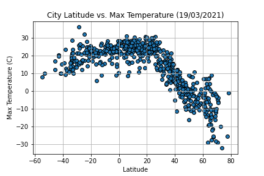
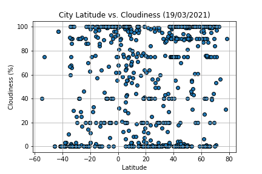
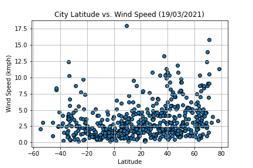

# Weather of 500+ cities across the world
Python API project for Monash Data Analytics Boot Camp

The purpose of this project was to analyse how weather changes as you get closer to the equator. To accomplish this analysis, we first pull data from the OpenWeatherMap API to assemble a dataset on over 500 cities. After assembling the dataset, we use Matplotlib to plot various aspects of the weather vs. latitude. Factors looked at included: temperature, cloudiness, wind speed, and humidity. Then we applied custom filters in order to find cities which meet the specified weather requirements and used Google Places API in order to find the first hotel for each city located within 5000 meters of each city coordinates.

# WeatherPy

### Data

There are two key sources of data used:

* [citipy Python library](https://pypi.python.org/pypi/citipy) - python library which allows to look up the nearest city given a set of geo coordinates

* [OpenWeatherMap API](https://openweathermap.org/api) - OpenWeatherMap API which contains weather data for any location including over 200,000 cities 

### Analysis

* Generate random list of cities using citipy Python library

* Perform OpenWeatherMap API call and retrive information about weather for each city

* Save the data as csv file

* Create a series of scatter plots to showcase the following relationships:
    * Temperature (F) vs. Latitude
    * Humidity (%) vs. Latitude
    * Cloudiness (%) vs. Latitude
    * Wind Speed (mph) vs. Latitude

* Run linear regression on each relationship for cities located on the Northern Hemisphere 

* Run linear regression on each relationship for cities located on the Southern Hemisphere 

# VacationPy

### Data

There are two key sources of data used:

* [cities.csv](output_data/cities.csv) - .csv file with weather data

* [Google Places API](https://openweathermap.org/api) - OpenWeatherMap API which contains weather data for any location including over 200,000 cities

### Analysis

* Create a heat map that displays the humidity for every city from the cities.csv dataset:

* Filter the cities.csv dataset based on the specified weather requirements:
    * zero cloudiness
    * humidity higher than 50%
    * wind speed lower than 5 km/h
    * max temperature higher than 15 deg C but lower than 25 deg C

* Perform Google Places API call to find the first hotel for each city located within 5000 meters of city's coordinates

* Plot the hotels on top of the humidity heatmap with each pin containing the **Hotel Name**, **City**, and **Country**:

# Demo

To run the example locally run `WeatherPy.ipynb` and `VacationPy.ipynb` files in Jupyter Notebook.

NOTE: both files require api keys for OpenWeatherMap API and Google Places API.

# Used Tools
 * Jupyter Notebook 
 * Pandas
 * Matplotlib
 * numpy 
 * gmaps
 * citipy
